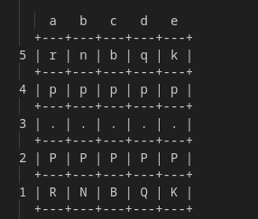

## Below is the official rulebook for this 5×5 MiniChess variant:

---

# MiniChess Rulebook

Welcome to MiniChess – a fast‐paced, simplified chess variant played on a 5×5 board. This rulebook explains the setup, piece movements, special moves, and win conditions for the game.

---

## 1. Board Setup

- **Board Size:** The game is played on a 5×5 grid.
- **Coordinates:**  
  - **Files (columns):** Labeled **a** to **e** from left to right.
  - **Ranks (rows):** Labeled **5** (top) to **1** (bottom).
- **Starting Position:**  
  - **Black Pieces (top two ranks):**
    - **Row 5 (Rank 5, index 0):** a5 = **r** (rook), b5 = **n** (knight), c5 = **b** (bishop), d5 = **q** (queen), e5 = **k** (king)
    - **Row 4 (Rank 4, index 1):** All five squares (a4–e4) are occupied by **p** (pawns)
  - **White Pieces (bottom two ranks):**
    - **Row 2 (Rank 2, index 3):** All five squares (a2–e2) are occupied by **P** (pawns)
    - **Row 1 (Rank 1, index 4):** a1 = **R** (rook), b1 = **N** (knight), c1 = **B** (bishop), d1 = **Q** (queen), e1 = **K** (king)

*Note:* In this game, **uppercase letters represent White’s pieces** and **lowercase letters represent Black’s pieces**.

---

## 2. Pieces and Their Movements

### Pawn (P/p)
- **Movement:**  
  - **White Pawns:** Move “up” (toward a lower row index; visually, upward on the board).
  - **Black Pawns:** Move “down” (toward a higher row index).
- **Rules:**
  - **Advance:** Move one square straight ahead provided the destination square is empty.
  - **Capture:** Move one square diagonally forward to capture an opponent’s piece.
  - **No Double Step:** Unlike standard chess, pawns cannot move two squares on their first move.
  
### Rook (R/r)
- **Movement:** Moves any number of squares horizontally (along a rank) or vertically (along a file).
- **Obstruction:** The rook cannot leap over any piece; every square between its starting and ending square must be empty.
  
### Knight (N/n)
- **Movement:** Moves in an “L” shape:
  - Two squares in one direction (horizontal or vertical) then one square perpendicular.
- **Special:** Knights can jump over pieces.

### Bishop (B/b)
- **Movement:** Moves any number of squares diagonally.
- **Obstruction:** The path must be free of any pieces between the starting and destination squares.
  
### Queen (Q/q)
- **Movement:** Combines the powers of the rook and bishop.
  - Moves horizontally, vertically, or diagonally any number of squares.
- **Obstruction:** Movement is blocked if any pieces stand in the path.

### King (K/k)
- **Movement:** Moves one square in any direction (horizontally, vertically, or diagonally).
- **Check:** The king cannot move into a square that is under attack.
- **Special – Castling (Queenside Only):**
  - The king may move two squares to the left in a queenside castling maneuver.
  - **Conditions for Castling:**
    1. **Starting Position:** The king must be on its original square (White king on e1; Black king on e5).
    2. **Rook Involvement:** The only eligible rook is the one on the left edge (White rook on a1; Black rook on a5).
    3. **Unmoved Pieces:** Neither the king nor the corresponding rook must have moved earlier in the game.
    4. **Clear Path:** All squares between the king and the rook (for White: b1, c1, and d1) must be empty.
    5. **No Check:** The king must not be in check, and the squares the king moves through (including its destination) must not be attacked by any enemy piece.
  - **After Castling:**  
    - The king moves two squares left.
    - The rook moves to the square immediately to the right of the king’s destination.

---

## 3. Turn Order and Move Rules

- **First Move:** White always moves first.
- **Alternating Turns:** Players alternate moves.
- **Move Validation:**  
  - A player may only move one of their own pieces.
  - A move is illegal if it results in capturing one’s own piece.
  - If a move would leave or put one’s own king in check, it is not allowed.
  - When in check, a player must make a move that removes the check (either by moving the king, capturing the attacking piece, or blocking the check).

---

## 4. Check and Checkmate

- **Check:**  
  - A king is said to be in check if an opponent’s piece attacks the square the king occupies.
- **Forced Check Removal:**  
  - If your king is in check, your move must address the threat. Any move that does not remove the check is illegal.
- **Checkmate:**  
  - Although the current implementation does not fully detect checkmate, the game ends when a king is captured. (Note: A more advanced checkmate detection may be implemented in the future.)

---

## 5. Winning the Game

- **Victory Condition:**  
  - The game is won by capturing the opponent’s king. When a king is captured, the game is immediately over.
  
---

## 6. Additional Considerations

- **Board Bounds:**  
  - All moves must remain within the confines of the 5×5 board. Any move that references a square outside this grid is invalid.
- **Castling Flags:**  
  - The game tracks whether the king or rook has moved to determine if castling is still permitted.
- **Piece Interactions:**  
  - All movement rules, including capturing and obstruction, are enforced according to the guidelines above.

---

Your goal is to implement a two player version of this game using the skeleton file given to you in chess_test.py. Good luck!!

  The beginning board should look like this (White pieces are at the bottom, Black pieces are at the top). Input is gien to it in the format:                   square of origin destination square. Ex: e1 e2

  All of the rules above should be implemented. To check if your program passes the base test cases, comment out the line     #unittest.main(verbosity = 0)
 in the below section:-
  if __name__ == "__main__":
    # main()
    #unittest.main(verbosity = 0)

   If your program passes all the tests (the counter should say 32/32 points and show no errors), raise your hand, we will come to you and perform some manual testing, if your game passes, congratulations! You have won. For a bit of extra fun you can also implement checkmate (Minichess does not have a checkmate but we have included a default stub method for it.)This will be tested manually.

